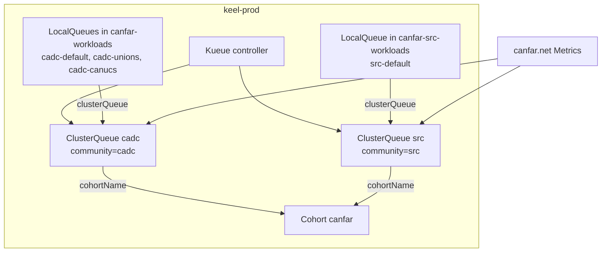

# Kueue ClusterQueues

CANFAR uses [Kueue](https://kueue.sigs.k8s.io/) to admit Skaha session Jobs into cluster-wide quota. This repository holds the desired controller Helm values, ClusterQueues, Cohort, flavors, priorities, and namespaced LocalQueues. **Two different Argo CD control planes** apply them.

Metrics platform totals on canfar.net Skaha (`view=stats`) sum the ClusterQueues named in `METRICS_PROVIDERS__KUEUE__CLUSTER_QUEUES`. See [Skaha Metrics deployment](skaha-metrics.md).

## Ownership

| Layer | What | Who applies it |
| ----- | ---- | -------------- |
| Kueue controller, ResourceFlavor, WorkloadPriorityClass, ClusterQueue, Cohort | [`manifests/kueue/`](../manifests/kueue/) | Cluster-operator Argo CD ApplicationSet (outside the canfar.net / src.canfar.net app-of-apps). Files are named so the set can glob `prod.*.yml` on keel-prod and `dev.*.yml` on the development cluster. |
| LocalQueue | [`helm/values/canfar.net/kueue/`](../helm/values/canfar.net/kueue/) and [`helm/values/src.canfar.net/kueue/`](../helm/values/src.canfar.net/kueue/) | Child Applications in this repo: [`canfar-kueue-staging-cadc`](../argocd/applications/canfar.net/kueue/staging.yaml) and [`canfar-kueue-staging-src`](../argocd/applications/src.canfar.net/kueue/staging.yaml). |

The LocalQueue Applications **do not** reconcile the controller or ClusterQueues. Changing quota or queue names in `manifests/kueue/` is not enough until the operator ApplicationSet syncs those files.

## Objects on keel-prod



| Object | Name | Namespace / scope | File |
| ------ | ---- | ----------------- | ---- |
| ClusterQueue | `cadc` | cluster | [`manifests/kueue/clusterQueues/prod.cadc.yml`](../manifests/kueue/clusterQueues/prod.cadc.yml) |
| ClusterQueue | `src` | cluster | [`manifests/kueue/clusterQueues/prod.src.yml`](../manifests/kueue/clusterQueues/prod.src.yml) |
| Cohort | `canfar` | cluster | [`manifests/kueue/clusterQueues/prod.cohorts.yml`](../manifests/kueue/clusterQueues/prod.cohorts.yml) |
| ResourceFlavor | `default` | cluster | [`manifests/kueue/controller/prod.resourceFlavors.yml`](../manifests/kueue/controller/prod.resourceFlavors.yml) |
| WorkloadPriorityClass | `low`, `medium`, `high` | cluster | [`manifests/kueue/controller/prod.workloadPriority.yml`](../manifests/kueue/controller/prod.workloadPriority.yml) |
| Controller Helm values | — | `kueue-system` | [`manifests/kueue/controller/prod.controller.yml`](../manifests/kueue/controller/prod.controller.yml) |
| LocalQueue | `cadc-default`, `cadc-unions`, `cadc-canucs` | `canfar-workloads` | [`helm/values/canfar.net/kueue/localQueues/prod.cadc.yml`](../helm/values/canfar.net/kueue/localQueues/prod.cadc.yml) |
| LocalQueue | `src-default` | `canfar-src-workloads` | [`helm/values/src.canfar.net/kueue/localQueues/prod.src.yml`](../helm/values/src.canfar.net/kueue/localQueues/prod.src.yml) |

`cadc` admits Jobs from `canfar-workloads` only. `src` admits Jobs from `canfar-src-workloads` only. Both join Cohort `canfar` for borrowing and preemption. Metrics does **not** read the Cohort; platform capacity is the sum of configured ClusterQueue nominal quotas.

### Labels

ClusterQueues carry:

```yaml
labels:
  app.kubernetes.io/name: kueue
  app.kubernetes.io/part-of: canfar
  canfar.net/community: cadc   # or src — must match the queue name
```

`canfar.net/community` is the Metrics **Community** selector. The Cohort has `name` / `part-of` only (it spans both communities). Do not put `canfar.net/username` on these shared default LocalQueues.

Skaha session Jobs use live labels `canfar.net/*`. The controller `labelKeysToCopy` list still includes legacy `canfar-net-*` keys so older Jobs keep transferring until they drain. Keep [`controller.config.yml`](../manifests/kueue/controller/controller.config.yml) and the embedded `controllerManagerConfigYaml` in `prod.controller.yml` **the same document** (indent in the Helm block only). Do not add a Kubernetes `metadata` block to that Configuration — Kueue unmarshals it strictly.

### Quotas

Authoritative numbers are in the ClusterQueue YAML. Current prod nominal/lending limits:

| Resource | `cadc` | `src` |
| -------- | -----: | ----: |
| cpu | 2800 | 200 |
| memory | 12400Gi | 1600Gi |
| ephemeral-storage | 99200Gi | 4800Gi |
| nvidia.com/gpu | 112 | 0 |

### Skaha queue names

| Skaha values | `queueName` | LocalQueue |
| ------------ | ----------- | ---------- |
| [`helm/values/canfar.net/skaha/staging.yaml`](../helm/values/canfar.net/skaha/staging.yaml) (and prod) | `cadc-default` | CADC sessions |
| [`helm/values/src.canfar.net/skaha/staging.yaml`](../helm/values/src.canfar.net/skaha/staging.yaml) (and prod) | `src-default` | SRC sessions |

Headless sessions use the same LocalQueue with a lower WorkloadPriorityClass (`low` vs `high`).

## Development cluster

A **separate** cluster uses the `dev.*` files. It is not an overlay on keel-prod.

| Knob | Prod (`prod.*`) | Dev (`dev.*`) |
| ---- | --------------- | ------------- |
| Controller requests / limits | 2 CPU / 4Gi, 6 CPU / 12Gi | 250m / 512Mi, 1 CPU / 1Gi |
| Managed namespaces | `canfar-workloads` and `canfar-src-workloads` | `canfar-workloads` only |
| ClusterQueues | `cadc` and `src` | `cadc` only (no `dev.src.yml`) |
| cadc cpu / memory / ephemeral / GPU | 2800 / 12400Gi / 99200Gi / 112 | 28 / 124Gi / 992Gi / 0 |
| nodeSelector | `skaha.opencadc.org/node-type: service-node` | same |

Dev cadc quota is 1% of prod cadc for cpu, memory, and ephemeral storage, with GPU disabled. ResourceFlavor and priority class **names** match prod (`default`, `low` / `medium` / `high`); that is safe because they land on another cluster.

> [!WARNING]
> If the destination cluster does not label service nodes `skaha.opencadc.org/node-type: service-node`, the controller will not schedule. Drop the selector in that environment's `*.controller.yml` only.

Dev LocalQueues are not synced by the canfar.net Argo Applications in this repo; apply them with the same operator process used for that cluster.

## Changing ClusterQueues

Renaming a ClusterQueue is a Kubernetes **delete and create**, not a field patch. Apply the new ClusterQueue, matching LocalQueue `clusterQueue:` / file name, Skaha `queueName`, and Metrics `CLUSTER_QUEUES` in one window. The old object remains until the operator ApplicationSet **prunes** it. Workloads already bound to the old queue do not move automatically.

File names must keep the `prod.` or `dev.` prefix and a `.yml` suffix so the ApplicationSet glob still matches (the Cohort file is `prod.cohorts.yml`, not `.yaml`).

## Verify

```bash
kubectl get clusterqueue,cohort
kubectl get localqueue -n canfar-workloads
kubectl get localqueue -n canfar-src-workloads

kubectl get clusterqueue cadc -o jsonpath='{.metadata.labels}{"\n"}{.spec.cohortName}{"\n"}'
kubectl get clusterqueue src -o jsonpath='{.metadata.labels}{"\n"}{.spec.cohortName}{"\n"}'
```

Expect `canfar.net/community` to equal the queue name, `cohortName: canfar`, and LocalQueues bound to `cadc` or `src` as in the tables above. After a Metrics or Skaha change, confirm platform stats still line up with those ClusterQueues ([Skaha Metrics deployment](skaha-metrics.md#verify)).
