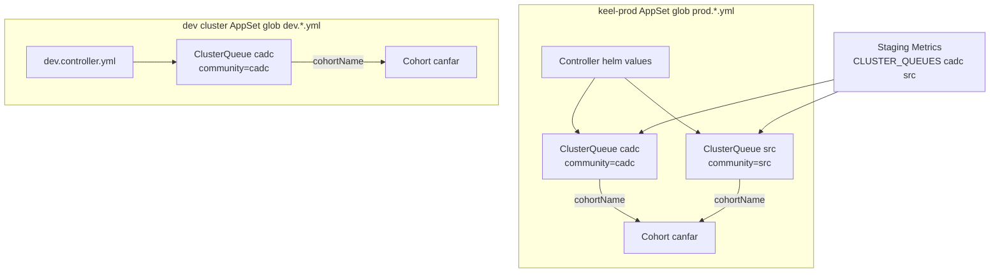

# Kueue ClusterQueues for Metrics + a parallel dev stack

Staging Metrics on `keel-prod` already reads ClusterQueues `cadc` and `ska`. This change absorbs [PR #7 / CADC-16007](https://github.com/cadc-ccda-infra/keel-deploy/pull/7) (`ska` → `src`), stamps Metrics `canfar.net/community` labels, fixes the Cohort glob, and adds a **separate-cluster** cadc-only dev Kueue stack (1% quotas, no GPU).



<Stat>
- Branch: new from main (good) -- cherry-pick PR 7 then labels and dev
- Community labels: cadc / src (good) -- match renamed queue names
- Dev quota: 1 percent of cadc, GPU 0 (note) -- cpu 28, mem 124Gi, eph 992Gi
- PR 7: close as superseded (note) -- https://github.com/cadc-ccda-infra/keel-deploy/pull/7
</Stat>

<Callout type="decision">
**Absorb, do not stack.** New branch from `origin/main`, cherry-pick `77c38b5` (`CADC-16007-rename-clusterqueue-ska-to-src`), then commit labels + Cohort glob + dev stack. Close [PR #7](https://github.com/cadc-ccda-infra/keel-deploy/pull/7) as superseded once this PR is up.
</Callout>

<Callout type="risk">
Renaming ClusterQueue `ska` → `src` is a Kubernetes delete-and-create, not a field patch. Apply the new ClusterQueue, LocalQueue `src-default`, SRC Skaha `queueName`, and Metrics `CLUSTER_QUEUES` in one window. The old `ska` object will linger until the ClusterOperator AppSet prunes it. In-flight workloads still bound to `ska` will not move automatically.
</Callout>

<Phase title="Cherry-pick CADC-16007 ska to src" status="planned">
Take [PR #7](https://github.com/cadc-ccda-infra/keel-deploy/pull/7) as-is, then add the one gap it left: Metrics still lists `ska`.

- ClusterQueue file `prod.ska.yml` → `prod.src.yml`, `metadata.name: src`
- LocalQueue `ska-default` → `src-default`, `clusterQueue: src`, file `prod.src.yml`
- Argo include `{localQueues/prod.src.yml}`
- SRC Skaha staging/prod `queueName: src-default`
- Comment paths in canfar.net Skaha values
- **Also** set `METRICS_PROVIDERS__KUEUE__CLUSTER_QUEUES` to `cadc` and `src` in canfar.net Skaha staging and prod (PR #7 only fixed comments)
- Point SRC READMEs at `prod.src.yml` / `src-default`
</Phase>

<Phase title="Fix the Cohort glob and stamp Metrics labels" status="planned">
Rename `prod.cohorts.yaml` so the AppSet actually deploys the Cohort. Add `canfar.net/community` matching the queue name. Keep `app.kubernetes.io/name: kueue` and add `app.kubernetes.io/part-of: canfar` on ClusterQueues **and** the Cohort. Metrics does not read Cohorts, so the Cohort gets no community label (it spans `cadc` and `src`).

```yaml title="manifests/kueue/clusterQueues/prod.cadc.yml" ins={6-7}
metadata:
  name: cadc
  labels:
    app.kubernetes.io/name: kueue
    app.kubernetes.io/part-of: canfar
    canfar.net/community: cadc
```

```yaml title="manifests/kueue/clusterQueues/prod.src.yml" ins={6-7}
metadata:
  name: src
  labels:
    app.kubernetes.io/name: kueue
    app.kubernetes.io/part-of: canfar
    canfar.net/community: src
```

```yaml title="manifests/kueue/clusterQueues/prod.cohorts.yml" ins={6}
metadata:
  name: canfar
  labels:
    app.kubernetes.io/name: kueue
    app.kubernetes.io/part-of: canfar
spec: {}
```

Quota, `namespaceSelector`, `cohortName: canfar`, admission, and preemption stay as they are. Already `kueue.x-k8s.io/v1beta2` with `cohortName`.
</Phase>

<Phase title="Add the dev controller Helm values" status="planned">
Copy [prod.controller.yml](manifests/kueue/controller/prod.controller.yml) to `dev.controller.yml`. Keep embedded `config.kueue.x-k8s.io/v1beta2` (no standalone config file for dev). Shrink manager resources. Restrict managed namespaces to `canfar-workloads` only (no SRC).

<Matrix>
| Knob | Prod | Dev |
|------|------|-----|
| Controller requests | 2 CPU / 4Gi | 250m / 512Mi |
| Controller limits | 6 CPU / 12Gi | 1 CPU / 1Gi |
| Managed namespaces | canfar-workloads + SRC | canfar-workloads |
| ClusterQueues | cadc + src | cadc only |
| nodeSelector | service-node | same as prod |
</Matrix>

<Callout type="warn">
Dev keeps `skaha.opencadc.org/node-type: service-node`. If the dest cluster does not label nodes that way, the controller will not schedule — drop the selector then. Fair-sharing, `labelKeysToCopy`, and Prometheus stay identical to prod.
</Callout>
</Phase>

<Phase title="Add dev flavors, priorities, cadc queue, and Cohort" status="planned">
`dev.resourceFlavors.yml` and `dev.workloadPriority.yml` are the prod objects with the same names (`default`, `low`/`medium`/`high`) plus `part-of: canfar`. Safe because this is a separate cluster.

`dev.cadc.yml` is prod `cadc` with `cohortName: canfar`, community `cadc`, GPU quota `0`, and 1% of the other nominal/lending limits. No `dev.src.yml`.

<Matrix>
| Resource | Prod cadc | Dev cadc |
|----------|-----------|----------|
| cpu | 2800 | 28 |
| memory | 12400Gi | 124Gi |
| ephemeral-storage | 99200Gi | 992Gi |
| nvidia.com/gpu | 112 | 0 |
</Matrix>
</Phase>

<FileTree>
- move manifests/kueue/clusterQueues/prod.ska.yml -> manifests/kueue/clusterQueues/prod.src.yml
- move helm/values/src.canfar.net/kueue/localQueues/prod.ska.yml -> helm/values/src.canfar.net/kueue/localQueues/prod.src.yml
- move manifests/kueue/clusterQueues/prod.cohorts.yaml -> manifests/kueue/clusterQueues/prod.cohorts.yml
- modify manifests/kueue/clusterQueues/prod.cadc.yml -- community=cadc plus part-of
- modify manifests/kueue/clusterQueues/prod.src.yml -- name src, community=src, part-of
- modify helm/values/src.canfar.net/kueue/localQueues/prod.src.yml -- src-default bound to src
- modify argocd/applications/src.canfar.net/kueue/staging.yaml -- include prod.src.yml
- modify helm/values/src.canfar.net/skaha/staging.yaml -- queueName src-default
- modify helm/values/src.canfar.net/skaha/prod.yaml -- add kueue block src-default
- modify helm/values/canfar.net/skaha/staging.yaml -- CLUSTER_QUEUES cadc src plus comment paths
- modify helm/values/canfar.net/skaha/prod.yaml -- CLUSTER_QUEUES cadc src plus comment paths
- modify helm/values/src.canfar.net/README.md -- src-default / prod.src.yml
- modify argocd/applications/src.canfar.net/README.md -- prod.src.yml
- add manifests/kueue/controller/dev.controller.yml -- v1beta2 embed, small size, canfar-workloads only
- add manifests/kueue/controller/dev.resourceFlavors.yml -- default flavor
- add manifests/kueue/controller/dev.workloadPriority.yml -- low medium high
- add manifests/kueue/clusterQueues/dev.cadc.yml -- 1 percent cadc, GPU 0
- add manifests/kueue/clusterQueues/dev.cohorts.yml -- Cohort canfar
</FileTree>

<Callout type="tip">
Dev LocalQueues stay operator-applied. Do not add `canfar.net/username` to shared CADC queues (`cadc-default`, etc.). Full ADR-0010 Metrics env rewrite (NAMESPACES, drop v0.1.5 cache/kube-transport keys, image bump) stays a follow-up — only the `ska` → `src` queue name in `CLUSTER_QUEUES` lands here.
</Callout>

<Checklist title="Done when">
- [ ] New branch from main contains cherry-picked CADC-16007 plus labels/dev
- [ ] ClusterQueue and LocalQueue names are `src` / `src-default`, not `ska`
- [ ] Metrics `CLUSTER_QUEUES` lists `cadc` and `src`
- [ ] AppSet glob `prod.*.yml` picks up the renamed Cohort
- [ ] `cadc` and `src` have nonempty `canfar.net/community` matching their names
- [ ] `dev.*` files exist for controller, flavor, priorities, cadc queue, and Cohort
- [ ] Dev cadc quotas are 28 CPU / 124Gi / 992Gi / 0 GPU
- [ ] PR 7 closed as superseded after this PR is opened
</Checklist>
