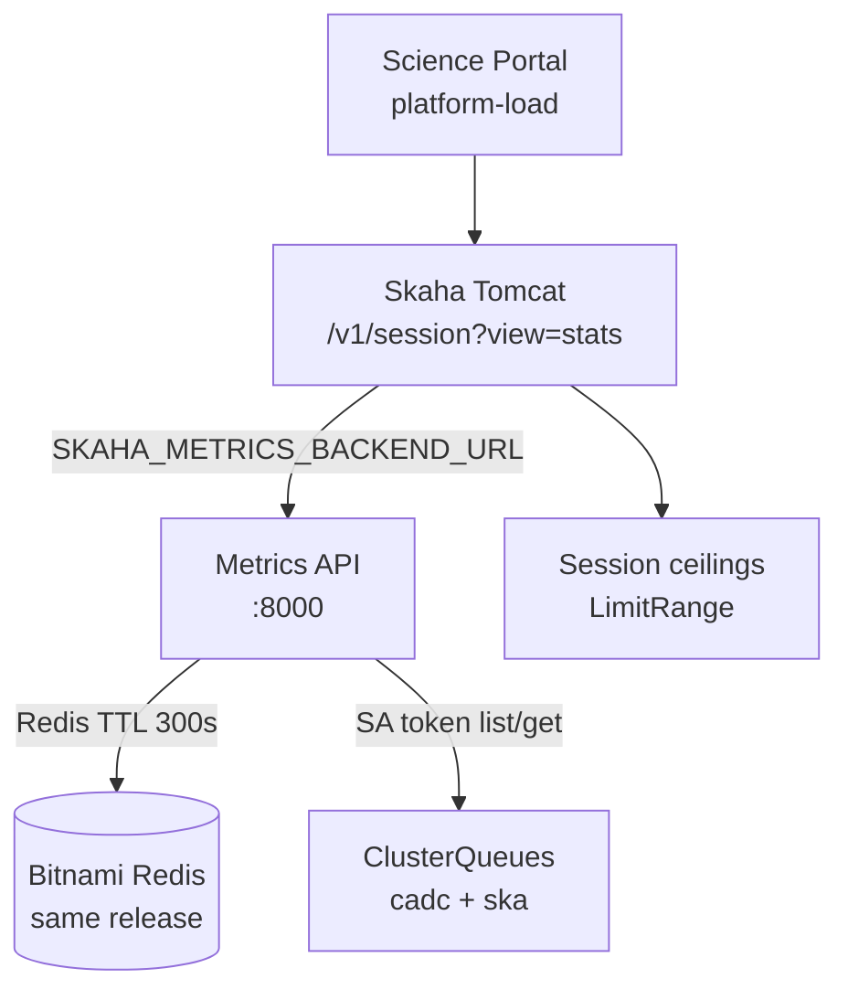

# Skaha + Metrics on staging.canfar.net

Cluster evaluation on `keel-prod` shows the staging path is **already deployed and serving real Kueue platform metrics**. Remaining work is end-to-end sign-off (`view=stats`), RBAC ownership, and a controlled promote path (not a greenfield install).

<Stat>
- Argo app: Synced / Healthy (good) -- `canfar-skaha-staging`
- Chart: skaha@1.6.0 (note) -- `images.opencadc.org/chartrepo/platform`
- Metrics image: v0.1.5 (good) -- platform GET returns Success
- Skaha image: 1.3.1-rc.1 (note) -- `MetricsDAO` classes present in WAR
- Authenticated stats: pending (warn) -- anonymous GET returns 400
</Stat>



## What is live on keel-prod today

| Component | Location | Evidence |
|-----------|----------|----------|
| Argo CD app | `canfar-argocd` / `canfar-skaha-staging` | Synced, Healthy |
| Namespace | `canfar-system-staging` | Ingress host `staging.canfar.net` |
| Metrics API | `canfar-skaha-staging-skaha-metrics-api` | 1/1 Ready, image `metrics:v0.1.5` |
| Metrics Service | `...-skaha-metrics-api-svc:8000` | ClusterIP only (no public ingress) |
| Skaha | 3× tomcat replicas | image `skaha:1.3.1-rc.1` |
| Shared SA | `canfar-skaha-staging` | used by both workloads |
| Redis | release Bitnami master | `METRICS_REDIS_URL` injected by chart |
| SRC Skaha | `canfar-src-staging` | `metricsBackend.enabled: false` (out of scope unless requested) |

### Metrics platform GET (verified)

From the Metrics pod on `keel-prod` (`2026-07-15`):

```bash
GET /healthz -> 200 {"status":"ok"}
GET /api/v1/metrics/platform -> 200
```

```json
{
  "version": "metrics.canfar.net/v1",
  "kind": "PlatformMetrics",
  "metadata": { "created": "2026-07-15T21:56:21.035013Z" },
  "status": "Success",
  "data": {
    "scope": "platform",
    "cluster": "canfar",
    "capacity": {
      "cpu": "3000",
      "memory": "14000Gi",
      "nvidia.com/gpu": "112",
      "ephemeral-storage": "104000Gi"
    },
    "allocated": {
      "cpu": "106.25",
      "memory": "881Gi",
      "nvidia.com/gpu": "5",
      "ephemeral-storage": "302Gi"
    }
  }
}
```

Additional checks that passed:

- Metrics SA can `list`/`get` `kueue.x-k8s.io/v1beta2/clusterqueues` (`cadc`, `ska`) with its own token → **200**
- Skaha Tomcat can GET the in-cluster Metrics Service URL → **200** (same payload)
- Skaha env includes `SKAHA_METRICS_BACKEND_URL=http://canfar-skaha-staging-skaha-metrics-api-svc.canfar-system-staging.svc.keel-prod.local:8000`
- Deployed WAR contains `org.opencadc.skaha.metrics.MetricsDAO` / `PlatformMetricsDAO`

### Intentional gaps / residual risks

<Callout type="warn">
`metricsBackend.rbac.enabled` is **false** in GitOps values. Chart does not own the Kueue ClusterRole/Binding, yet the shared SA can list ClusterQueues today (pre-provisioned / cluster-managed RBAC we cannot fully invent from this kubectl principal). Prefer flipping chart RBAC on so GitOps owns the grant.
</Callout>

<Callout type="note">
Public Metrics ingress is off (404 at `staging.canfar.net/metrics/...`). That matches the design: Skaha uses the in-cluster Service URL only.
</Callout>

<Callout type="risk">
Anonymous `GET https://staging.canfar.net/skaha/v1/session?view=stats` returns **400** (`cannot get group memberships for anonymous`). Authenticated E2E proof that Skaha maps Metrics → `ResourceStats` is still outstanding.
</Callout>

<Phase title="Confirm staging GitOps matches desired contract" status="done">
Values under `keel-deploy/helm/values/canfar.net/skaha/staging.yaml` already set:

- `metricsBackend.enabled: true`
- full `METRICS_*` env map (Kueue, Redis cache, queues `cadc`/`ska`)
- Skaha image with Metrics client classes
- Argo app points at published chart `skaha@1.6.0` + keel-deploy values from `main`

No greenfield Helm install is required for `staging.canfar.net`.
</Phase>

<Phase title="Sign off authenticated Skaha stats → Metrics path" status="active">
Prove the Science Platform path users care about.

1. With a CANFAR cert/session, call `GET /skaha/v1/session?view=stats` on `staging.canfar.net`.
2. Expect **200** with cluster capacity/allocated aligned to Metrics platform snapshot (not zeros / legacy node listing).
3. Briefly stop Metrics (or break URL in a non-prod experiment) and confirm Skaha returns **503** `"Platform statistics unavailable"` (fail closed).
4. Confirm Science Portal `platform-load` (`science-portal` route that calls `view=stats`) renders load numbers on staging.

```bash
# In-cluster Metrics (already verified)
kubectl exec -n canfar-system-staging deploy/canfar-skaha-staging-skaha-metrics-api -- \
  python3 -c 'import urllib.request; print(urllib.request.urlopen("http://127.0.0.1:8000/api/v1/metrics/platform").read().decode())'

# Authenticated Skaha stats (needs user credentials)
curl -E "$CADCPROXY" \
  "https://staging.canfar.net/skaha/v1/session?view=stats"
```
</Phase>

<Phase title=" Harden RBAC ownership in keel-deploy" status="planned">
Make Kueue read grants chart-managed instead of ambient.

<FileTree>
- modify helm/values/canfar.net/skaha/staging.yaml -- set metricsBackend.rbac.enabled: true
- modify argocd/applications/canfar.net/skaha/staging.yaml -- only if chart bump required for RBAC template
</FileTree>

1. Set `metricsBackend.rbac.enabled: true` on staging overlay.
2. Sync Argo; confirm ClusterRole/Binding appear for SA `canfar-skaha-staging`.
3. Re-GET `/api/v1/metrics/platform` (still 200, non-empty capacity).
4. Document that SRC (`metricsBackend.enabled: false`) stays deferred.
</Phase>

<Phase title="Optional polish before calling staging done" status="planned">
- Keep Metrics ingress disabled unless ops explicitly wants edge debugging.
- Leave `METRICS_OTEL_METRICS_ENABLED=false` until ops OTLP endpoint is ready (roll Metrics before Skaha per contract).
- Bump Metrics/Skaha tags only if science-platform HEAD has fixes beyond `metrics:v0.1.5` / `skaha:1.3.1-rc.1`.
- Do **not** treat local `deployments/helm/applications/archived/skaha` as deploy source; published chart is authoritative.
</Phase>

<Phase title="Promote pattern to prod / integration after staging sign-off" status="planned">
`prod.yaml` / `integration.yaml` today only stub `METRICS_ENVIRONMENT`. Copy the staging metrics env map (environment-specific names/queues), enable `metricsBackend`, sync Argo prod app when it exists, verify platform GET + authenticated `view=stats`.

<Compare>
## Staging-first (pick)
- pro: metrics + Skaha client already live on keel-prod staging
- pro: fail-closed stats can be proven without touching www
- con: authenticated check still needs a human cert

## Enable prod in the same change
- pro: one PR
- con: prod overlay incomplete; higher blast radius if stats go 503
</Compare>
</Phase>

<Checklist title="Staging done when">
- [x] Metrics API Running in `canfar-system-staging`
- [x] `GET /api/v1/metrics/platform` returns Success with Kueue capacity/allocated
- [x] Skaha has `SKAHA_METRICS_BACKEND_URL` and can reach Metrics Service
- [x] Deployed Skaha WAR includes `MetricsDAO` / `PlatformMetricsDAO`
- [ ] Authenticated `GET /skaha/v1/session?view=stats` returns Metrics-backed totals
- [ ] Science Portal platform-load on staging shows those totals
- [ ] Chart-owned Kueue RBAC enabled (`metricsBackend.rbac.enabled: true`) or documented as intentionally external
- [ ] Staging sign-off recorded before prod overlay expands beyond `METRICS_ENVIRONMENT`
</Checklist>

<Questions>
- Is authenticated `view=stats` + portal platform-load enough to call staging complete, or do you also want `metricsBackend.rbac.enabled: true` in the same change?
  - Stats + portal only; leave RBAC as pre-provisioned
  - Stats + portal, and flip chart RBAC on in keel-deploy
  - Also enable Metrics on SRC staging (`src.canfar.net`)
- Should OTEL (`METRICS_OTEL_METRICS_ENABLED` / Skaha agent) be part of this staging track or a follow-up?
  - Follow-up after ops OTLP endpoint
  - Include in staging now
</Questions>
