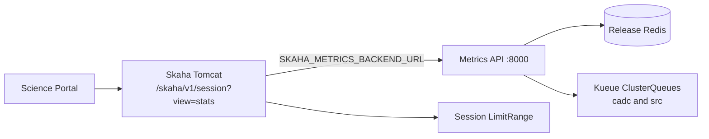

# Skaha Metrics deployment

The Science Platform Metrics API is **not** a separate Argo CD application. It is an optional workload in the published **Skaha Helm chart**, toggled from GitOps values in this repository. When it is enabled, Skaha and Metrics share one Helm release, and Skaha `GET /skaha/v1/session?view=stats` reads cluster **capacity** and **allocated** from Metrics instead of listing nodes.

This document describes how that stack is wired on CANFAR. Chart templates and the Metrics HTTP contract live in the [science-platform](https://github.com/opencadc/science-platform) repository; this repo owns **chart version pins**, **values**, and **Argo CD Applications**.

## Architecture



- **Science Portal** calls Skaha `view=stats` (platform load). It does not call Metrics directly.
- **Skaha** uses the in-cluster Metrics Service URL the chart injects as `SKAHA_METRICS_BACKEND_URL`. There is no in-process stats cache; Metrics owns Redis TTL and snapshot freshness.
- **Metrics** aggregates **platform** totals from the configured Kueue ClusterQueues. Cohort membership is not a Metrics source.
- **LimitRange** in the session namespace supplies per-session ceilings (`maxCPUCores` / `maxRAM` on the stats payload). That is independent of Kueue quota.
- Metrics has **no public ingress** on CANFAR. Edge debugging of Metrics is optional and off by default.

When Metrics is unreachable or the platform report is not usable, Skaha returns **503** with `"Platform statistics unavailable"` (fail closed). Unrelated Skaha routes do not require Metrics.

## Where it is deployed

| Environment | Argo Application | Namespace | Hostname | Metrics |
| ----------- | ---------------- | --------- | -------- | ------- |
| canfar.net staging | [`canfar-skaha-staging`](../argocd/applications/canfar.net/skaha/staging.yaml) | `canfar-system-staging` | `staging.canfar.net` | enabled |
| canfar.net production | [`canfar-skaha-prod`](../argocd/applications/canfar.net/skaha/prod.yaml) | `canfar-system-production` | `ws-uv.canfar.net` | enabled |
| src.canfar.net staging | [`src-skaha-staging`](../argocd/applications/src.canfar.net/skaha/staging.yaml) | `canfar-src-staging` | `staging-src.canfar.net` | disabled |
| src.canfar.net production | [`src-skaha-prod`](../argocd/applications/src.canfar.net/skaha/prod.yaml) | `canfar-src-production` | `src.canfar.net` | disabled |

canfar.net Metrics still lists **both** ClusterQueues (`cadc` and `src`) so platform totals cover the whole Keel cluster. SRC Skaha does not run a second Metrics copy.

[`helm/values/canfar.net/skaha/integration.yaml`](../helm/values/canfar.net/skaha/integration.yaml) only sets `METRICS_ENVIRONMENT`. There is no canfar.net Skaha integration Application in this repo yet.

## GitOps sources

```text
argocd/applications/canfar.net/skaha/
  staging.yaml          # Harbor chart + base.yaml + staging.yaml
  prod.yaml

helm/values/canfar.net/skaha/
  base.yaml             # shared Skaha defaults (not Metrics)
  staging.yaml          # metricsBackend + telemetry + hostname
  prod.yaml
  integration.yaml     # METRICS_ENVIRONMENT stub only

helm/values/src.canfar.net/skaha/
  staging.yaml          # metricsBackend.enabled: false
```

Each Skaha Application pulls the **skaha** chart from `https://images.opencadc.org/chartrepo/platform` (`targetRevision` on the Application) and overlays values from this Git repo (`ref: values`). Do not treat `deployments/helm/applications/archived/skaha` as the install source.

Kueue ClusterQueues that Metrics reads are documented in [Kueue ClusterQueues](kueue.md).

## Values that matter

Operational knobs live under `metricsBackend` in the environment overlay. Chart defaults apply for probes, Service shape, and resource requests unless you override them.

| Key | Role on CANFAR |
| --- | -------------- |
| `metricsBackend.enabled` | Install the Metrics Deployment and Service, and inject `SKAHA_METRICS_BACKEND_URL` on Tomcat. |
| `metricsBackend.rbac.enabled` | Chart-owned Kueue RBAC. **Leave `false` on keel-prod** (see [RBAC](#rbac)). |
| `metricsBackend.image.tag` | Metrics image pin. |
| `metricsBackend.env` | Full `METRICS_*` map for that overlay (cluster name, Kueue queues, cache, OTEL). |
| `telemetry.controller` / `telemetry.otlp` | Skaha Tomcat OTLP metrics. `telemetry.metrics` stays `false` (reserved). |

Typical env keys in the canfar.net overlays:

- `METRICS_ENVIRONMENT` — `staging` or `production`
- `METRICS_CLUSTER_NAME` — `canfar`
- `METRICS_PROVIDERS__KUEUE__CLUSTER_QUEUES` — `'["cadc","src"]'` (JSON array string)
- `METRICS_OTEL_*` — Metrics application OTLP (see [Telemetry](#telemetry))

List-valued Metrics settings are **JSON arrays**, not comma-separated strings. Queue names here must match the live ClusterQueue objects.

Redis: the Skaha chart injects `METRICS_REDIS_URL` from the **same Bitnami Redis** subchart as Skaha (`<release>-redis-master`) when that path is enabled. Override in `metricsBackend.env` only for an external Redis.

Public Metrics ingress stays off (`metricsBackend.ingress.enabled` unset / false). Skaha talks to:

```text
http://<release>-skaha-metrics-api-svc.<namespace>.svc.keel-prod.local:8000
```

Example staging Service: `canfar-skaha-staging-skaha-metrics-api-svc.canfar-system-staging.svc.keel-prod.local:8000`.

## RBAC

Capsule on **keel-prod** forbids this tenant from creating or modifying `ClusterRole` / `ClusterRoleBinding`. GitOps therefore keeps:

```yaml
metricsBackend:
  rbac:
    enabled: false
rbac:
  clusterRole:
    create: false
```

Do not flip those on in this cluster. ClusterQueue `get`/`list` for the Metrics identity is **ambient** (provisioned outside the Skaha release). Namespaced LocalQueue Role/RoleBinding in tenant namespaces such as `canfar-workloads` remains allowed.

The Metrics process uses the in-cluster ServiceAccount token to read Kueue. Confirm the ServiceAccount actually used by the Metrics pod (release-dependent: shared Skaha SA or a dedicated Metrics SA, per chart version) can:

```bash
kubectl auth can-i get clusterqueues.kueue.x-k8s.io --as=system:serviceaccount:<namespace>:<sa>
kubectl auth can-i list clusterqueues.kueue.x-k8s.io --as=system:serviceaccount:<namespace>:<sa>
```

Platform metrics fail closed if those grants are missing.

## Telemetry

Roll Metrics OTEL independently of Skaha. Chart `telemetry.metrics` remains `false`; Metrics export is the `METRICS_OTEL_*` map.

On keel-prod the Prometheus OTLP receiver is **not** classic `:4318`. Use the operator Service:

| Workload | Setting | Endpoint |
| -------- | ------- | -------- |
| Metrics | `METRICS_OTEL_EXPORTER_OTLP_ENDPOINT` | `http://prometheus-operated.monitoring.svc:9090/api/v1/otlp/v1/metrics` |
| Skaha Tomcat | `telemetry.otlp.destination` | `http://prometheus-operated.monitoring.svc:9090/api/v1/otlp` (Java agent appends `/v1/metrics`) |

`prometheus.monitoring.svc` does not resolve; use `prometheus-operated.monitoring.svc`.

## Verify

Substitute the Argo release name and namespace for the environment you are checking.

```bash
# Workload
kubectl -n canfar-system-staging get deploy,svc -l app.kubernetes.io/component=metrics-api

# In-cluster health (path is /healthz or /readyz depending on the pinned Metrics image)
kubectl -n canfar-system-staging exec deploy/canfar-skaha-staging-skaha-metrics-api -- \
  python3 -c 'import urllib.request; print(urllib.request.urlopen("http://127.0.0.1:8000/healthz").read().decode())'

# Platform report. Newer Metrics images use:
#   GET /apis/canfar.net/v1alpha1/metrics/platform/canfar
# Older pins used GET /api/v1/metrics/platform. Use the route the image serves.
kubectl -n canfar-system-staging exec deploy/canfar-skaha-staging-skaha-metrics-api -- \
  python3 -c 'import urllib.request; print(urllib.request.urlopen("http://127.0.0.1:8000/apis/canfar.net/v1alpha1/metrics/platform/canfar").read().decode())'

# Authenticated platform stats (anonymous GET returns 400: no group memberships)
curl -E "$CADCPROXY" "https://staging.canfar.net/skaha/v1/session?view=stats"
```

Expect `view=stats` **200** with non-zero cluster capacity/allocated aligned to the Metrics snapshot, plus session ceilings from LimitRange. A Metrics outage should produce **503**, not zeros from node listing.

Science Portal platform-load on the same hostname is the user-facing check of the same Skaha route.

## Changing the deployment

1. Edit the environment overlay under `helm/values/<domain>/skaha/`.
2. Pin a new chart version only in the matching `argocd/applications/.../skaha/*.yaml` (`targetRevision`), after that chart is published to Harbor.
3. Keep `METRICS_PROVIDERS__KUEUE__CLUSTER_QUEUES` in lockstep with ClusterQueue names ([Kueue ClusterQueues](kueue.md)).
4. Leave SRC `metricsBackend.enabled: false` unless you intend a second Metrics workload in the SRC Skaha release.
